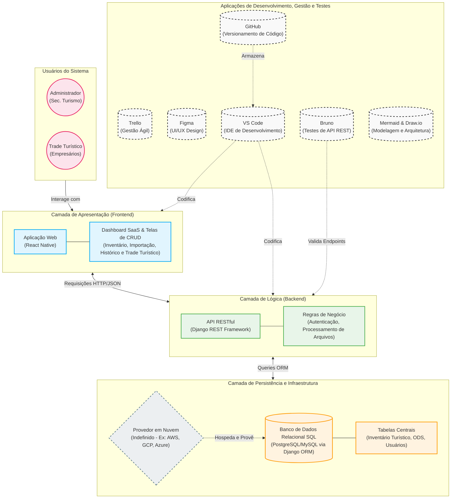

```mermaid
flowchart TB
   %% Definição de Estilos
   classDef tools fill:#f9f9f9,stroke:#333,stroke-width:2px,stroke-dasharray: 5 5;
   classDef front fill:#e1f5fe,stroke:#03a9f4,stroke-width:2px;
   classDef back fill:#e8f5e9,stroke:#4caf50,stroke-width:2px;
   classDef db fill:#fff3e0,stroke:#ff9800,stroke-width:2px;
   classDef actor fill:#fce4ec,stroke:#e91e63,stroke-width:2px;
   classDef cloud fill:#eceff1,stroke:#607d8b,stroke-width:2px,stroke-dasharray: 5 5;


   %% Atores do Sistema
   subgraph Atores ["Usuários do Sistema"]
       A1(("Administrador\n(Sec. Turismo)")):::actor
       A2(("Trade Turístico\n(Empresários)")):::actor
   end


   %% Ferramentas de Desenvolvimento e Gestão
   subgraph Ecossistema ["Aplicações de Desenvolvimento, Gestão e Testes"]
       direction LR
       T1[("Trello\n(Gestão Ágil)")]:::tools
       T2[("Figma\n(UI/UX Design)")]:::tools
       T3[("VS Code\n(IDE de Desenvolvimento)")]:::tools
       T4[("GitHub\n(Versionamento de Código)")]:::tools
       T5[("Bruno\n(Testes de API REST)")]:::tools
       T6[("Mermaid & Draw.io\n(Modelagem e Arquitetura)")]:::tools
   end


   %% Frontend
   subgraph Frontend ["Camada de Apresentação (Frontend)"]
       F1["Aplicação Web\n(React Native)"]:::front
       F2["Dashboard SaaS & Telas de CRUD\n(Inventário, Importação, Histórico e Trade Turístico)"]:::front
       F1 --- F2
   end


   %% Backend
   subgraph Backend ["Camada de Lógica (Backend)"]
       B1["API RESTful\n(Django REST Framework)"]:::back
       B2["Regras de Negócio\n(Autenticação, Processamento de Arquivos)"]:::back
       B1 --- B2
   end


   %% Banco de Dados e Infraestrutura em Nuvem
   subgraph Database ["Camada de Persistência e Infraestrutura"]
       CLOUD{"Provedor em Nuvem\n(Indefinido - Ex: AWS, GCP, Azure)"}:::cloud
       DB1[("Banco de Dados Relacional SQL\n(PostgreSQL/MySQL via Django ORM)")]:::db
       DB2["Tabelas Centrais\n(Inventário Turístico, ODS, Usuários)"]:::db
      
       CLOUD -.->|Hospeda e Provê| DB1
       DB1 --- DB2
   end


   %% Relacionamentos e Fluxo de Dados
   Atores -->|Interage com| Frontend
   Frontend <-->|Requisições HTTP/JSON| Backend
   Backend <-->|Queries ORM| Database


   %% Relacionamento com as ferramentas
   T3 -.->|Codifica| Frontend
   T3 -.->|Codifica| Backend
   T4 -.->|Armazena| T3
   T5 -.->|Valida Endpoints| Backend
```