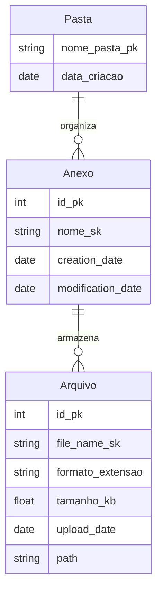

```mermaid
erDiagram
  Pasta ||--o{ Anexo : organiza
  Anexo ||--o{ Arquivo : armazena


  Pasta {
      string nome_pasta_pk
      date data_criacao
  }


  Anexo {
      int id_pk
      string nome_sk
      date creation_date
      date modification_date
  }


  Arquivo {
      int id_pk
      string file_name_sk
      string formato_extensao
      float tamanho_kb
      date upload_date
      string path
  }
%%|o : Zero ou Um (Opcional)
%%|| : Exatamente Umo
%% { : Zero ou Muitos
%% |{ : Um ou Muitos
```