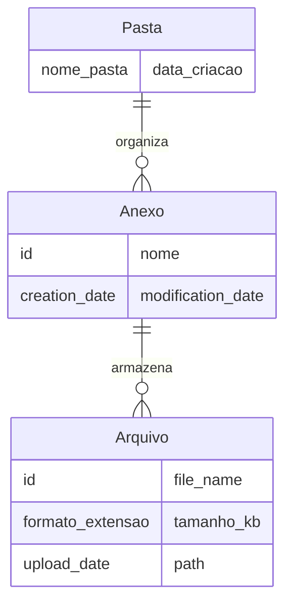

```mermaid
erDiagram
  Pasta ||--o{ Anexo : organiza
  Anexo ||--o{ Arquivo : armazena


  Pasta {
      nome_pasta
      data_criacao
  }


  Anexo {
      id
      nome
      creation_date
      modification_date
  }


  Arquivo {
      id
      file_name
      formato_extensao
      tamanho_kb
      upload_date
      path
  }
%%|o : Zero ou Um (Opcional)
%%|| : Exatamente Umo
%% { : Zero ou Muitos
%% |{ : Um ou Muitos
```
