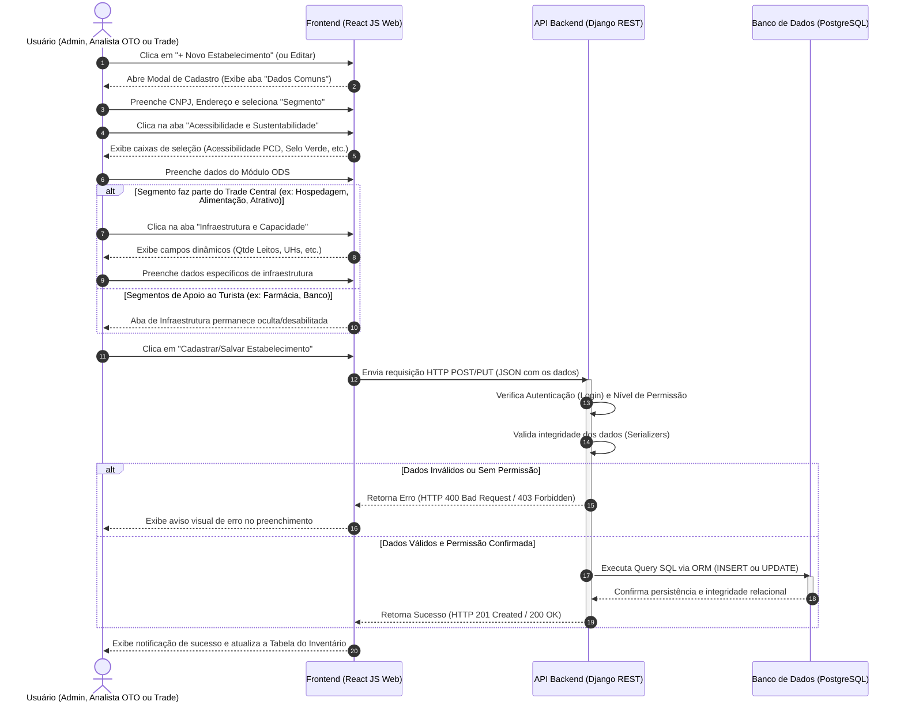

```mermaid
sequenceDiagram
    autonumber
    actor U as Usuário (Admin, Analista OTO ou Trade)
    participant F as Frontend (React JS Web)
    participant B as API Backend (Django REST)
    participant DB as Banco de Dados (PostgreSQL)

    U->>F: Clica em "+ Novo Estabelecimento" (ou Editar)
    F-->>U: Abre Modal de Cadastro (Exibe aba "Dados Comuns")
    
    U->>F: Preenche CNPJ, Endereço e seleciona "Segmento"
    
    U->>F: Clica na aba "Acessibilidade e Sustentabilidade"
    F-->>U: Exibe caixas de seleção (Acessibilidade PCD, Selo Verde, etc.)
    U->>F: Preenche dados do Módulo ODS
    
    alt Segmento faz parte do Trade Central (ex: Hospedagem, Alimentação, Atrativo)
        U->>F: Clica na aba "Infraestrutura e Capacidade"
        F-->>U: Exibe campos dinâmicos (Qtde Leitos, UHs, etc.)
        U->>F: Preenche dados específicos de infraestrutura
    else Segmentos de Apoio ao Turista (ex: Farmácia, Banco)
        F-->>U: Aba de Infraestrutura permanece oculta/desabilitada
    end

    U->>F: Clica em "Cadastrar/Salvar Estabelecimento"
    F->>B: Envia requisição HTTP POST/PUT (JSON com os dados)
    
    activate B
    B->>B: Verifica Autenticação (Login) e Nível de Permissão
    B->>B: Valida integridade dos dados (Serializers)
    
    alt Dados Inválidos ou Sem Permissão
        B-->>F: Retorna Erro (HTTP 400 Bad Request / 403 Forbidden)
        F-->>U: Exibe aviso visual de erro no preenchimento
    else Dados Válidos e Permissão Confirmada
        B->>DB: Executa Query SQL via ORM (INSERT ou UPDATE)
        activate DB
        DB-->>B: Confirma persistência e integridade relacional
        deactivate DB
        B-->>F: Retorna Sucesso (HTTP 201 Created / 200 OK)
    end
    deactivate B

    F-->>U: Exibe notificação de sucesso e atualiza a Tabela do Inventário
```