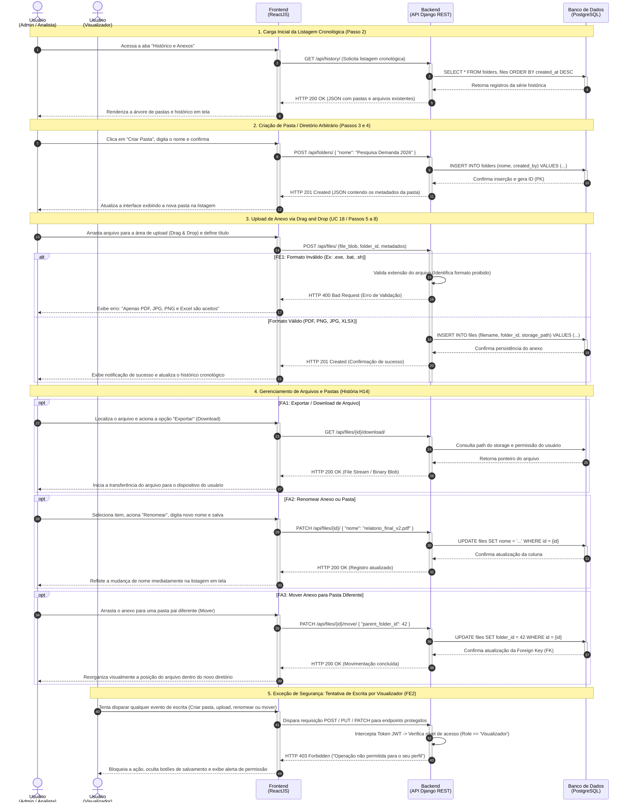

```mermaid
sequenceDiagram
    autonumber
    actor U as Usuário<br/>(Admin / Analista)
    actor V as Usuário<br/>(Visualizador)
    participant F as Frontend<br/>(ReactJS)
    participant B as Backend<br/>(API Django REST)
    participant DB as Banco de Dados<br/>(PostgreSQL)

    Note over U, DB: 1. Carga Inicial da Listagem Cronológica (Passo 2)
    U->>F: Acessa a aba "Histórico e Anexos"
    activate F
    F->>B: GET /api/history/ (Solicita listagem cronológica)
    activate B
    B->>DB: SELECT * FROM folders, files ORDER BY created_at DESC
    activate DB
    DB-->>B: Retorna registros da série histórica
    deactivate DB
    B-->>F: HTTP 200 OK (JSON com pastas e arquivos existentes)
    deactivate B
    F-->>U: Renderiza a árvore de pastas e histórico em tela
    deactivate F

    Note over U, DB: 2. Criação de Pasta / Diretório Arbitrário (Passos 3 e 4)
    U->>F: Clica em "Criar Pasta", digita o nome e confirma
    activate F
    F->>B: POST /api/folders/ { "nome": "Pesquisa Demanda 2026" }
    activate B
    B->>DB: INSERT INTO folders (nome, created_by) VALUES (...)
    activate DB
    DB-->>B: Confirma inserção e gera ID (PK)
    deactivate DB
    B-->>F: HTTP 201 Created (JSON contendo os metadados da pasta)
    deactivate B
    F-->>U: Atualiza a interface exibindo a nova pasta na listagem
    deactivate F

    Note over U, DB: 3. Upload de Anexo via Drag and Drop (UC 18 / Passos 5 a 8)
    U->>F: Arrasta arquivo para a área de upload (Drag & Drop) e define título
    activate F
    F->>B: POST /api/files/ (file_blob, folder_id, metadados)
    activate B

    alt FE1: Formato Inválido (Ex: .exe, .bat, .sh)
        B->>B: Valida extensão do arquivo (Identifica formato proibido)
        B-->>F: HTTP 400 Bad Request (Erro de Validação)
        F-->>U: Exibe erro: "Apenas PDF, JPG, PNG e Excel são aceitos"
    else Formato Válido (PDF, PNG, JPG, XLSX)
        B->>DB: INSERT INTO files (filename, folder_id, storage_path) VALUES (...)
        activate DB
        DB-->>B: Confirma persistência do anexo
        deactivate DB
        B-->>F: HTTP 201 Created (Confirmação de sucesso)
        F-->>U: Exibe notificação de sucesso e atualiza o histórico cronológico
    end
    deactivate B
    deactivate F

    Note over U, DB: 4. Gerenciamento de Arquivos e Pastas (História H14)
    
    opt FA1: Exportar / Download de Arquivo
        U->>F: Localiza o arquivo e aciona a opção "Exportar" (Download)
        activate F
        F->>B: GET /api/files/{id}/download/
        activate B
        B->>DB: Consulta path do storage e permissão do usuário
        DB-->>B: Retorna ponteiro do arquivo
        B-->>F: HTTP 200 OK (File Stream / Binary Blob)
        deactivate B
        F-->>U: Inicia a transferência do arquivo para o dispositivo do usuário
        deactivate F
    end

    opt FA2: Renomear Anexo ou Pasta
        U->>F: Seleciona item, aciona "Renomear", digita novo nome e salva
        activate F
        F->>B: PATCH /api/files/{id}/ { "nome": "relatorio_final_v2.pdf" }
        activate B
        B->>DB: UPDATE files SET nome = '...' WHERE id = {id}
        activate DB
        DB-->>B: Confirma atualização da coluna
        deactivate DB
        B-->>F: HTTP 200 OK (Registro atualizado)
        deactivate B
        F-->>U: Reflete a mudança de nome imediatamente na listagem em tela
        deactivate F
    end

    opt FA3: Mover Anexo para Pasta Diferente
        U->>F: Arrasta o anexo para uma pasta pai diferente (Mover)
        activate F
        F->>B: PATCH /api/files/{id}/move/ { "parent_folder_id": 42 }
        activate B
        B->>DB: UPDATE files SET folder_id = 42 WHERE id = {id}
        activate DB
        DB-->>B: Confirma atualização da Foreign Key (FK)
        deactivate DB
        B-->>F: HTTP 200 OK (Movimentação concluída)
        deactivate B
        F-->>U: Reorganiza visualmente a posição do arquivo dentro do novo diretório
        deactivate F
    end

    Note over V, DB: 5. Exceção de Segurança: Tentativa de Escrita por Visualizador (FE2)
    V->>F: Tenta disparar qualquer evento de escrita (Criar pasta, upload, renomear ou mover)
    activate F
    F->>B: Dispara requisição POST / PUT / PATCH para endpoints protegidos
    activate B
    B->>B: Intercepta Token JWT -> Verifica nível de acesso (Role == 'Visualizador')
    B-->>F: HTTP 403 Forbidden ("Operação não permitida para o seu perfil")
    deactivate B
    F-->>V: Bloqueia a ação, oculta botões de salvamento e exibe alerta de permissão
    deactivate F
```