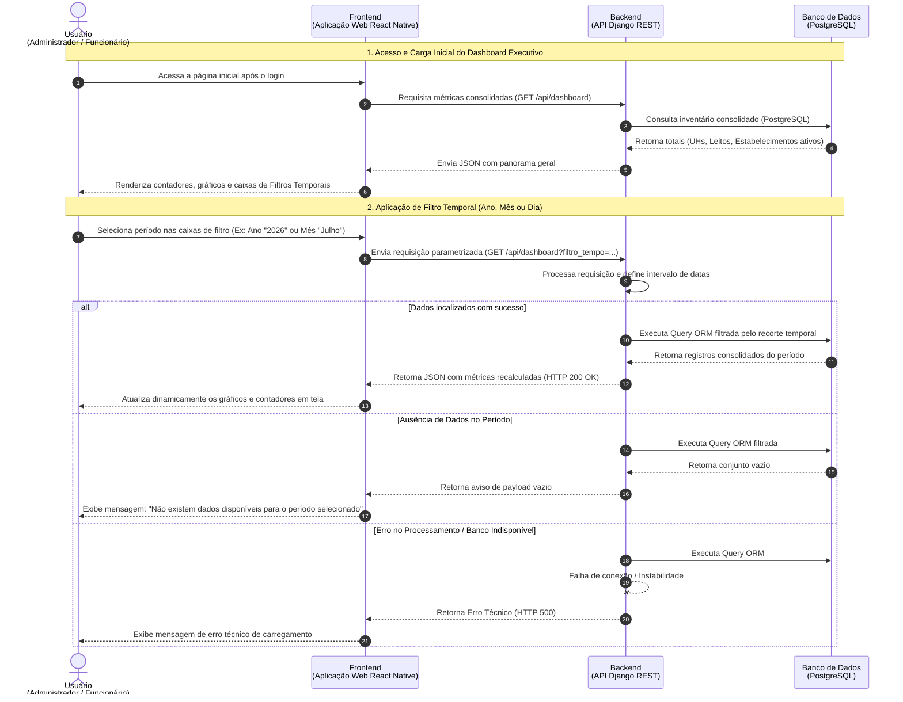

```mermaid
sequenceDiagram
    autonumber
    actor U as Usuário<br/>(Administrador / Funcionário)
    participant F as Frontend<br/>(Aplicação Web React Native)
    participant B as Backend<br/>(API Django REST)
    participant DB as Banco de Dados<br/>(PostgreSQL)
    
    Note over U, DB: 1. Acesso e Carga Inicial do Dashboard Executivo
    U->>F: Acessa a página inicial após o login
    F->>B: Requisita métricas consolidadas (GET /api/dashboard)
    B->>DB: Consulta inventário consolidado (PostgreSQL)
    DB-->>B: Retorna totais (UHs, Leitos, Estabelecimentos ativos)
    B-->>F: Envia JSON com panorama geral
    F-->>U: Renderiza contadores, gráficos e caixas de Filtros Temporais
    
    Note over U, DB: 2. Aplicação de Filtro Temporal (Ano, Mês ou Dia)
    U->>F: Seleciona período nas caixas de filtro (Ex: Ano "2026" ou Mês "Julho")
    F->>B: Envia requisição parametrizada (GET /api/dashboard?filtro_tempo=...)
    B->>B: Processa requisição e define intervalo de datas
    
    alt Dados localizados com sucesso
        B->>DB: Executa Query ORM filtrada pelo recorte temporal
        DB-->>B: Retorna registros consolidados do período
        B-->>F: Retorna JSON com métricas recalculadas (HTTP 200 OK)
        F-->>U: Atualiza dinamicamente os gráficos e contadores em tela
    else Ausência de Dados no Período
        B->>DB: Executa Query ORM filtrada
        DB-->>B: Retorna conjunto vazio
        B-->>F: Retorna aviso de payload vazio
        F-->>U: Exibe mensagem: "Não existem dados disponíveis para o período selecionado"
    else Erro no Processamento / Banco Indisponível
        B->>DB: Executa Query ORM
        B--xB: Falha de conexão / Instabilidade
        B-->>F: Retorna Erro Técnico (HTTP 500)
        F-->>U: Exibe mensagem de erro técnico de carregamento
    end

```